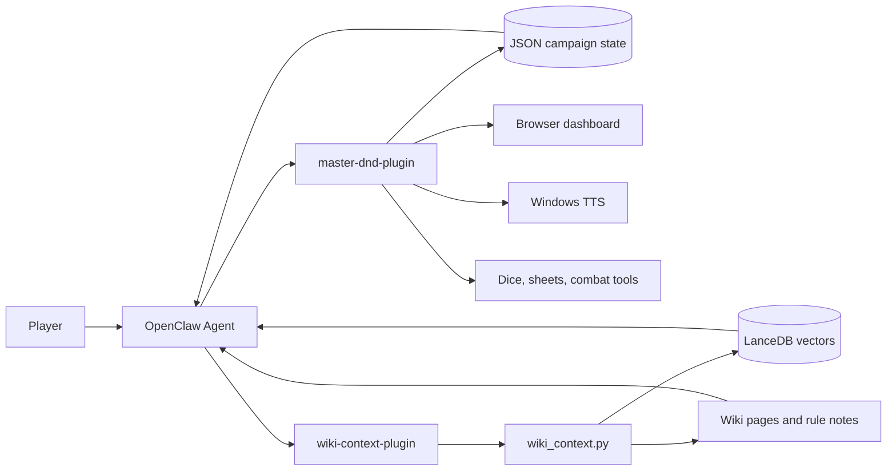

<div align="center">

# Master GDR D&D

**AI Game Master for OpenClaw campaigns**

Persistent campaign state, structured combat, dice rolling, browser dashboard, voice narration, and semantic rulebook memory for tabletop RPG sessions.

[](https://openclaw.ai)
[](https://nodejs.org/)
[](https://www.python.org/)
[](LICENSE)

`D&D 5e` . `Pathfinder` . `Cyberpunk RED` . `Call of Cthulhu` . `Fate` . `Any ruleset you describe`

</div>

---

## At a Glance

| Capability | What it gives the Game Master |
| --- | --- |
| Dice engine | Reliable rolls like `1d20+5`, `3d6`, advantage and disadvantage |
| Persistent state | Campaigns, characters, quests, HP, inventory and world state survive across sessions |
| Structured combat | Initiative order, damage/healing, active turns and grid positions |
| Semantic memory | LanceDB retrieves relevant session logs, rules and wiki notes by meaning |
| Dashboard | Browser view for party sheets, initiative and an 8x6 combat grid |
| Voice narration | Optional Windows TTS for spoken narration |
| System-agnostic play | Starts from D&D 5e, but adapts to other tabletop RPGs |

## Why It Exists

Most RPG chat bots can narrate a scene, but they lose campaign continuity. This project gives an OpenClaw agent the missing operational layer:

- current campaign state in JSON
- long-term semantic memory in LanceDB
- rule/context retrieval before the model answers
- tools for dice, sheets, combat, backups and narration

The result is an AI Game Master that can keep track of the table instead of improvising from a blank prompt every turn.

## Architecture



## Memory Model

| Layer | Storage | Purpose |
| --- | --- | --- |
| Campaign state | `state/*.json` | Characters, quests, HP, inventory, world state, initiative |
| Semantic memory | LanceDB | Session logs, extracted rules, wiki pages, campaign notes |
| Immediate context | Prompt injection | Current state plus relevant wiki snippets before each answer |

## Plugins

| Plugin | Role | Main files |
| --- | --- | --- |
| `master-dnd-plugin` | Core Game Master engine | `src/index.ts`, `index.js`, `dashboard.html` |
| `wiki-context-plugin` | RAG context injector | `wiki/plugins/wiki-context-plugin/` |

Both plugins are installed into OpenClaw and work together during every conversation.

## Quick Start

### Requirements

| Dependency | Version |
| --- | --- |
| OpenClaw | 2026.5.28 or newer |
| Node.js | 18 or newer |
| Python | 3.10 or newer |
| Shell | Windows PowerShell for `install.ps1` |

### Install

```powershell
git clone https://github.com/giovannifrontera/master-gdr-d-d.git
cd master-gdr-d-d
.\install.ps1
```

The installer registers both plugins:

```powershell
openclaw plugin add .\master-dnd-plugin
openclaw plugin add .\wiki\plugins\wiki-context-plugin
```

Python dependencies can also be installed manually:

```bash
pip install -r wiki/requirements.txt
```

## Dashboard

After starting a campaign, open:

```text
http://localhost:7332/
```

The dashboard is designed for the live table:

| View | Contents |
| --- | --- |
| Party | Character sheets, HP, stats, inventory and avatars |
| Map | Initiative order plus 8x6 combat grid |
| Chat | Browser interface for the Game Master agent |

## Tool Surface

All `rpg_*` tools also expose a `dnd_*` alias.

| Category | Tools |
| --- | --- |
| Campaign | `rpg_start_run`, `rpg_load_state`, `rpg_list_runs`, `rpg_save_state`, `rpg_update_state`, `rpg_restore_backup` |
| Characters | `rpg_create_character`, `rpg_get_sheet` |
| Dice and combat | `rpg_roll`, `rpg_combat_start`, `rpg_combat_damage`, `rpg_combat_next_turn`, `rpg_combat_end`, `rpg_set_combat_position` |
| Memory and rules | `rpg_log_turn`, `rpg_scan_manuals`, `rpg_wiki_process_raw`, `rpg_check_wiki`, `rpg_install_dependencies` |
| Voice | `rpg_narrate` |

## Optional Configuration

All keys are optional. Add overrides only when you need custom paths or ports.

```json
{
  "plugins": {
    "entries": {
      "master-dnd-plugin": {
        "config": {
          "stateDirectory": "C:/my-campaigns/state",
          "pythonExecutable": "python",
          "serverPort": 7331,
          "dashboardPort": 7332,
          "wikiEnabled": true,
          "debug": false
        }
      },
      "wiki-context-plugin": {
        "config": {
          "workspace": "C:/my-campaigns/wiki",
          "wikiContextScript": "C:/my-campaigns/wiki/scripts/wiki_context.py",
          "k": 3,
          "maxChars": 600,
          "timeoutMs": 15000
        }
      }
    }
  }
}
```

## Repository Layout

```text
master-gdr-d-d/
|-- master-dnd-plugin/              OpenClaw plugin for RPG state and tools
|   |-- src/index.ts                TypeScript source
|   |-- index.js                    Built plugin entry loaded by OpenClaw
|   |-- openclaw.plugin.json        Plugin manifest
|   |-- dashboard.html              Browser dashboard
|   `-- wiki-backend/               Bundled Python helper scripts
|-- wiki/                           Wiki/RAG subsystem
|   |-- scripts/                    Python CLI, server, embedding and PDF tools
|   |-- plugins/wiki-context-plugin OpenClaw context-injection plugin
|   |-- requirements.txt            Python dependencies
|   `-- wiki.config.json            Wiki configuration
|-- install.ps1                     Windows installer
|-- LICENSE                         AGPL-3.0
`-- state/                          Local campaign saves, gitignored
```

## Legal Note

Do not commit copyrighted rulebooks or campaign notes that you cannot redistribute. The repository ignores `manuali/`, `wiki/pdf-inbox/`, generated wiki memory, local state and audio output for this reason.

## License

GNU Affero General Public License v3.0. See [LICENSE](LICENSE).

Copyright (C) 2026 Giovanni Frontera
